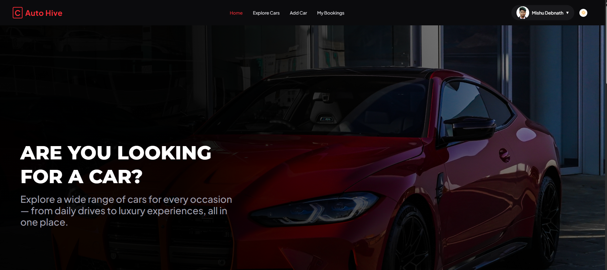

# 🚗 Auto Hive - Car Rental Platform

A modern and responsive full-stack car rental platform where users can explore available cars, view detailed car information, book vehicles, manage bookings, and add their own car listings securely.

---

# 📸 Project Screenshot



---

# 🔗 Live URL

[Auto Hive Live Website](https://autohive-sepia.vercel.app)

---

# 📌 Project Purpose

AutoHive is built to provide a smooth and modern car rental experience through a clean and user-friendly interface.

Users can browse available cars, search and filter vehicles, view detailed car information, book cars, and manage their personal bookings. The platform also allows authenticated users to add, update, and delete their own car listings securely.

---

# ✨ Key Features

- Responsive design for mobile, tablet, and desktop
- Modern and recruiter-friendly UI
- Dynamic Available Cars section from database
- Explore Cars page with search and filter functionality
- Detailed single car information page
- Secure authentication with email/password and Google login
- JWT authentication with HTTPOnly cookies
- Protected private routes
- Add new car listings
- Update and delete own added cars
- Book cars with booking management system
- Booking count increment using MongoDB `$inc`
- My Bookings page for logged-in users
- My Added Cars management dashboard
- Loading spinner during data fetching
- Custom 404 Not Found page
- Toast notifications for success and error handling
- Environment variables for secure configuration

---

# 🛠️ Technologies Used

## Frontend

- [Next.js](https://nextjs.org?utm_source=chatgpt.com)
- [React](https://react.dev?utm_source=chatgpt.com)
- [Tailwind CSS](https://tailwindcss.com?utm_source=chatgpt.com)
- [HeroUI](https://heroui.com/)
- [Framer Motion](https://www.framer.com/motion/?utm_source=chatgpt.com)

---

## Backend & Database

- [Node.js](https://nodejs.org?utm_source=chatgpt.com)
- [Express.js](https://expressjs.com?utm_source=chatgpt.com)
- [MongoDB](https://www.mongodb.com?utm_source=chatgpt.com)

---

# 📦 NPM Packages Used

```bash
next
react
react-dom
tailwindcss
heroui
framer-motion
betterauth
jsonwebtoken
cors
dotenv
mongodb
express
react-hottosat
react-icons
```

---

# 🔍 Search & Filter Features

- Search cars by car name using MongoDB `$regex`
- Filter cars by car type
- Show available and unavailable cars

---

# 🔒 Security Features

- JWT Token Authentication
- HTTPOnly Cookie Storage
- Protected Private Routes
- Protected Backend APIs
- Environment Variable Protection

---

# 📱 Responsive Design

The website is fully responsive for:

- Mobile Devices
- Tablets
- Desktop Screens

---
